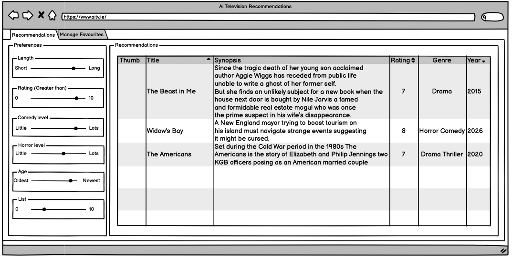

# Pre-AI Design Phase

**Document ID:** PREAI  
**Related:** [PDB](01-product-design-brief.md) | [ARCH](02-system-architecture.md) | [DATA](03-data-model-reference.md) | [PROMPT](04-prompt-engineering-lifecycle.md)  
**Last Updated:** May 2026  
**Status:** Final

---

## TL;DR

Before any AI tooling was invoked and before any application code was generated, the project was fully specified in writing: product scope, user flows, visual design direction, data models, feature-level layouts, filter behaviour, and a first-draft AI prompt. This phase is documented here because it reflects a deliberate practice — use AI to accelerate execution, not to substitute for thinking.

---

## 1. Why This Phase Matters

A common failure mode in AI-assisted development is reaching for code generation before the problem is defined. The result is fast output with unclear intent: components that don't serve a specific user need, data models that shift mid-build, and scope that drifts in whatever direction the model suggests.

This project inverted that sequence. The design phase produced seven specification documents before any scaffolding command was run. AI tooling was brought in only after the following questions had written answers:

- Who is the user and what do they need?
- What does the product do and what does it explicitly not do?
- What does each screen look like and how does each interaction behave?
- What data does the system produce and consume?
- What standards govern the generated code?
- What does the initial AI prompt look like?

The specifications then served as grounding material for all subsequent AI-assisted code generation — they were the context window, not the output.

---

## 2. Wireframes

Wireframes for the two-panel recommendation layout were created and iterated before any specification writing began. The wireframe file (`wireframes/TV Recommendations.pdf`) established the core spatial decisions that every subsequent specification and implementation decision referred back to.


*The original wireframes created before any specification writing or code generation began. The 30/70 filter/results split, bottom drawer on mobile, and card grid layout were all established at this stage.*

**Key decisions made at the wireframe stage:**

### The 30/70 split

The single most important layout decision: the filter panel occupies approximately 30% of the horizontal space on desktop, with 70% given to the recommendation results. This ratio was not arbitrary — it reflected a deliberate judgment that the results are the primary content and the filters are a secondary control surface. The split is specified in `specs/features/Recommendations.md` and is unchanged in the final production build.

### The bottom drawer on mobile

Rather than hiding filters behind a settings icon or a separate screen, the wireframe established a bottom drawer pattern for mobile. This keeps the filter interaction model consistent across breakpoints while giving the results full viewport width on small screens. The pattern is specified in `specs/features/dashboard.md` with explicit breakpoints: 30/70 desktop, 35/65 tablet, full-width with drawer on mobile (<768px).

### Two-tab navigation

The wireframe defined exactly two tabs — Recommendations and Manage Favourites — with Recommendations as the landing tab. A third tab for library status (My Shows) was added later during development. The original two-tab constraint is documented in `specs/features/dashboard.md` under "What NOT to build": *Do not add a third tab or any additional navigation items.*

### Card-grid results layout

The recommendation output was always a card grid, not a list or table. Each card was specified to show: poster thumbnail, title, genre tags, and a one-line reason. The card design was part of the wireframe and carried through unchanged to the implementation.

---

## 3. The Specification Documents

Seven specification files were committed in `8abb99f Initial commit` — the first commit in the repository. No application code existed at this point. The specs were the starting artifact.

### `specs/product-overview.md` — Product Definition

Established the product in one page: what it does, who it is for, the AI integration approach, the tech stack, and the out-of-scope list. Notable for its explicit constraint list:

> No user authentication or accounts  
> No connection to streaming platforms  
> No ability to mark shows as watched within the app  
> No social or sharing features  
> No admin panel  
> No mobile app (responsive web only)

Each exclusion was deliberate. The admin panel and My Shows tab were both added later — as deliberate scope expansions during development, not as oversights in the original spec.

**What changed:** The stack entry read "Next.js 14" and "Vercel AI SDK" — both were updated during implementation (Next.js 16 App Router, direct Anthropic SDK streaming rather than the Vercel AI SDK abstraction).

### `specs/user-flows.md` — User Journey

Defined four flows in order:

1. **First visit** — empty state → Manage Favourites → upload → generation → Recommendations tab
2. **Filtering** — slider interaction → real-time client-side filtering → empty state handling
3. **Return visit** — localStorage restoration → immediate results without API call
4. **Regeneration** — navigate to Manage Favourites → fresh submission → prior results cleared

The flows are written as numbered steps, not prose — each step is an implementable unit. Step 10 of the first-visit flow reads: *"Right panel shows skeleton loading cards during AI processing."* This is a UI state specification, not a description of a feature. That level of precision was what made the spec useful as a code generation context.

**What changed:** The return visit flow specified "Previous file and keywords are not pre-populated." This was later changed — the app now restores prior favourites input from localStorage. The user feedback driving that change was that starting fresh every time felt like a regression.

### `specs/design-system.md` — Visual Identity

A deliberately short document — eight bullet points defining the aesthetic:

```
Style:
- cinematic
- modern streaming platform
- inspired by Netflix + Letterboxd + Spotify
- dark mode first
- immersive browsing experience
- elegant typography
- rich poster artwork
- subtle hover animations
- polished recommendation cards
```

**Why this mattered:** When feeding this to a code generation tool alongside a component spec, "Netflix + Letterboxd + Spotify" produces a meaningfully different starting point than no design context at all. The dark-mode-first constraint eliminated a class of styling decisions. "Rounded-xl cards with subtle shadows" is a Tailwind/shadcn convention that the spec adopted explicitly.

**What survived unchanged:** The entire design system. The production UI is dark-mode-first, uses Inter, uses shadcn/ui components, and matches the cinematic character described. The spec was written once and never revisited.

### `specs/data-models.md` — Data Model

The data model was defined before any code existed. The spec defined three entities:

**TV Show** (TVDB-sourced fields):
```
id, title, one_sentence_synopsis, release_year,
episode_runtime_minutes, content_rating, genres[],
tvdb_poster_thumbnail_url, average_user_rating,
imdb_rating, streaming_platforms[]
```

**AI Recommendation Attributes** (Claude-generated):
```
comedy_score (0-10), horror_score (0-10),
action_score (0-10), drama_score (0-10),
suspense_score (0-10), romance_score (0-10)
```

**Recommendation Metadata**:
```
recommendation_score, matched_keywords[], similarity_reason
```

**Why this is significant:** The six AI genre scores — `comedy_score`, `horror_score`, `action_score`, `drama_score`, `suspense_score`, `romance_score` — were specified in the data model before the prompt was written, and before it was known how they would be generated. The decision to make filtering work on AI-generated scores rather than categorical tags was a data model decision, not a prompt engineering decision. It was made at this stage.

The `TypeScript` interface in `lib/types.ts` is a direct implementation of this spec. The field names are identical. The spec was the source of truth.

**What changed:** `recommendation_score` and `matched_keywords[]` were reserved fields that were defined speculatively and never implemented. `similarity_reason` became `reason` in the implementation.

### `specs/features/dashboard.md` — Application Shell

Specified the full shell structure: fixed top navigation bar, two tabs, full-height content area, no sidebar. All four global states were defined here:

- **Loading** — skeleton cards, filter panel hidden
- **Error** — full-width error banner, retry button, prior results preserved
- **Empty** — centred empty state with CTA to Manage Favourites
- **Returning user** — immediate restoration, "Last updated" label

The responsive breakpoints are specified with pixel values: `<768px` mobile, `768–1024px` tablet, `>1024px` desktop. These values are in the production CSS.

The "What NOT to build" list is instructive:
> Do not build authentication or user accounts  
> Do not build a settings page or profile page  
> Do not add a third tab or any additional navigation items  
> Do not add a footer  
> Do not add onboarding or tutorial overlays

Every item on this list is a feature that code generation tools tend to add speculatively when not constrained. The explicit prohibition list served as a guardrail.

### `specs/features/ManageFavourites.md` — Favourites Feature

The most detailed specification — covers layout, component states, validation rules, and the first draft of the AI system prompt. Key inclusions:

**Component state machines** — every interactive element is defined with its complete state set. The upload button has five states (default, file selected, uploading, error, success). The submit button has four (disabled, active, loading, error). This level of state specification was fed directly into component generation prompts.

**Validation rules** — defined before implementation:
- File must be `.csv` or `.txt`, under 5MB
- Text area max 1,000 characters (later expanded to 5,000)
- At least one of file or keywords required

**The v0 AI Prompt** — the first version of the system prompt was written here, in the spec, before the API route existed:

```
You are a personalised entertainment recommendation engine.

The user will provide a list of favourites — TV shows, films,
genres, or keywords — either as uploaded file content or as
free text. Your job is to return a curated list of
recommendations based on those preferences.

Rules:
- Return exactly 6 recommendations
- Never recommend something the user has already listed
  as a favourite
- Always explain in one sentence why each item is recommended
  based on their specific inputs
- If input is too vague to generate confident recommendations,
  return your best attempt and flag uncertainty in the reason field

Respond ONLY in this JSON format:
{
  "recommendations": [
    {
      "title": "Show or film name",
      "genres": ["genre1", "genre2"],
      "reason": "One sentence explanation tied to their input"
    }
  ]
}
```

This is the prompt that went into the first working implementation. See `[PROMPT]` for the full evolution from this v0 to the production prompt — eight iterations over 43 commits.

**What the v0 prompt was missing** (identified by comparing to the final prompt):
- No genre scoring dimensions — filter sliders had no data
- No constraint against self-corrections mid-generation
- No prompt injection isolation
- No multilingual no-overlap clause
- No `romance_score` field
- Fixed count of 6 (later made configurable, up to 10)

### `specs/features/Recommendations.md` — Recommendations Feature

Specified the two-panel layout, all six filter sliders with their metrics and label text, the card structure, and all component states. The slider definitions were written with precision:

| Slider | Metric | Min Label | Max Label |
|--------|--------|-----------|-----------|
| Runtime | `episode_runtime_minutes` | Short | Long |
| Rating | `imdb_rating` | 0 | 10 |
| Comedy Level | `comedy_score` | Not funny | Very funny |
| Horror Level | `horror_score` | Not scary | Very scary |
| Age | `release_year` (dynamic range) | Earliest year in results | Latest year |
| List | Visible count | 1 | 10 |

All six of these are in the production build, with identical metric mappings. The dynamic year range (min/max derived from the returned recommendations, not hardcoded) is implemented exactly as specified.

The "What NOT to build" list:
> Do not fetch real IMDB ratings — the AI returns a rating estimate  
> Do not trigger new API calls on slider change — all filtering is client-side  
> Do not build a user account system  
> Do not add sorting controls beyond the sliders  
> Do not paginate — max 10 results, all shown at once

### `specs/ai-rules.md` — Coding Standards

A short but high-value document — eight rules governing all AI-generated code:

```
Always:
- use TypeScript
- use server actions where possible
- use zod validation
- use React Query for client fetching
- use shadcn/ui
- avoid mock APIs
- avoid placeholder lorem ipsum
- generate production-grade code
```

**Why this document existed:** Without it, code generation tools default to their training distribution — which often includes JavaScript instead of TypeScript, fetch without validation, and placeholder data. Feeding this document as context to every generation prompt anchored the output to the project's standards.

**What changed:** React Query was not used in the final implementation — server actions and the native `fetch` + `ReadableStream` API handled data fetching. The SSE streaming pattern did not fit the React Query model. Everything else was followed throughout.

---

## 4. What the Pre-AI Phase Produced

| Artefact | Status in Final Build |
|----------|----------------------|
| 30/70 filter/results layout | Unchanged |
| Bottom drawer on mobile | Unchanged |
| Two-tab navigation | Expanded to three tabs (My Shows added) |
| Dark mode first, Inter, shadcn/ui | Unchanged |
| Six filter sliders with defined metrics | Unchanged |
| Card grid with poster, title, genre, reason | Enhanced (streaming platform icons, detail flyover added) |
| `localStorage` for recommendations + filters | Unchanged |
| Data model field names | Unchanged (implementation matches spec) |
| v0 AI system prompt (6 recommendations, basic JSON) | Evolved through 8 iterations — see `[PROMPT]` |
| Validation rules (file type, size, required fields) | Unchanged |
| Responsive breakpoints (768px, 1024px) | Unchanged |
| "What NOT to build" constraints | Mostly held — admin panel and My Shows tab added as deliberate expansions |

---

## 5. The Sequence: Design → Spec → Build

The project followed a deliberate three-phase sequence:

```
Phase 1: Design (pre-AI)
    Wireframes → spatial decisions, layout, interaction model
    Spec documents → product scope, user flows, data model,
                     feature detail, v0 prompt, coding standards
    No application code exists at this point.

Phase 2: Scaffold (AI-assisted, spec-grounded)
    v0 UI scaffold generated using specs as context (commit 7325071)
    TVDB API integration
    First AI recommendations endpoint (commit d85af47)
    Initial streaming implementation (commit 8b58196)

Phase 3: Iterate and Harden (AI-assisted, eval-grounded)
    Prompt evaluation framework built (commit 13d4ef8)
    Progressive streaming architecture (commit 6b73ed1)
    Prompt injection hardening (commit 0c955dc)
    Mobile layout refinements (commit f67da65)
    Usage logging and cost tracking (commit fefc7c5)
    Prompt iterations guided by eval scores (see [EVAL])
    Cross-script deduplication (commit 2ec19ca)
```

Phase 1 was entirely human-authored. Phases 2 and 3 used AI tooling, but both were grounded in the Phase 1 artefacts rather than open-ended generation. The specs served as the grounding context; the wireframes served as the layout anchor; and the eval framework (built at the start of Phase 3) served as the quality signal for all subsequent prompt changes.

---

## Supporting File References

- [`specs/product-overview.md`](../../specs/product-overview.md) — product definition, core capabilities, out-of-scope list
- [`specs/user-flows.md`](../../specs/user-flows.md) — four user journeys with numbered steps
- [`specs/design-system.md`](../../specs/design-system.md) — visual identity and component conventions
- [`specs/data-models.md`](../../specs/data-models.md) — TV Show, AI Recommendation Attributes, Recommendation Metadata
- [`specs/features/dashboard.md`](../../specs/features/dashboard.md) — shell structure, tab navigation, global states, responsive breakpoints
- [`specs/features/ManageFavourites.md`](../../specs/features/ManageFavourites.md) — upload states, keywords input, v0 AI system prompt, validation rules
- [`specs/features/Recommendations.md`](../../specs/features/Recommendations.md) — two-panel layout, all six slider definitions, card structure
- [`specs/ai-rules.md`](../../specs/ai-rules.md) — coding standards applied to all AI-generated code
- Git commit `8abb99f` — "Initial commit": all spec files, no application code
- Git commit `7325071` — "Adding v0 scaffold": first application code, generated using specs as context
