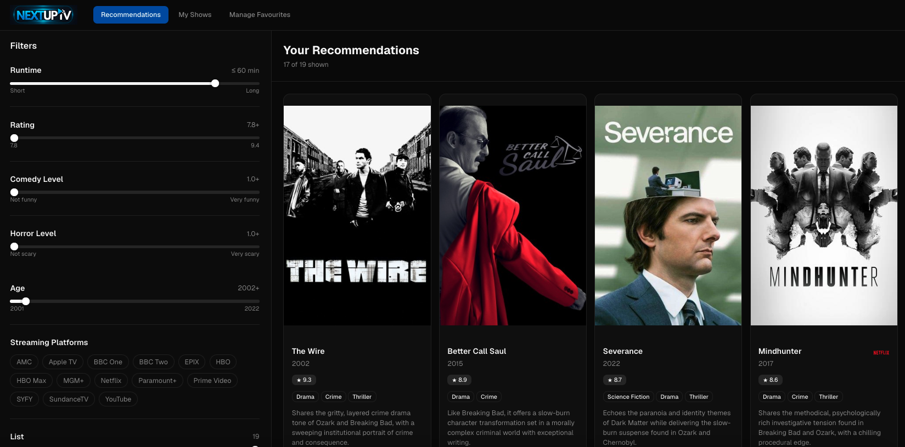
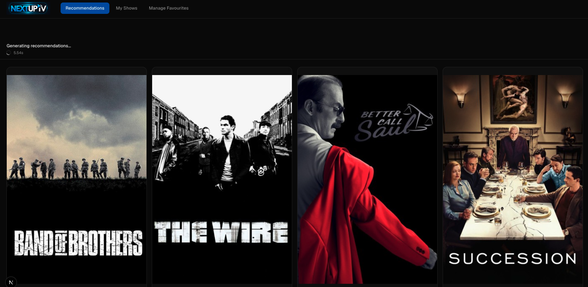
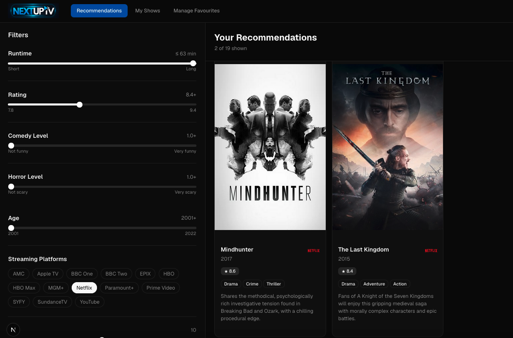
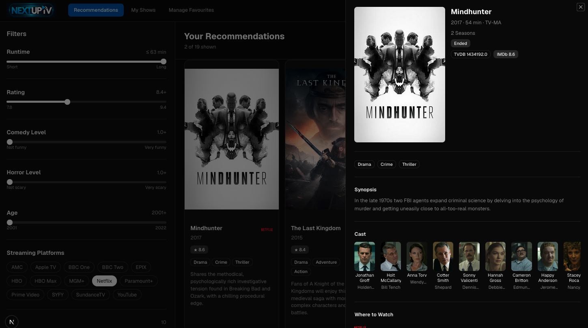
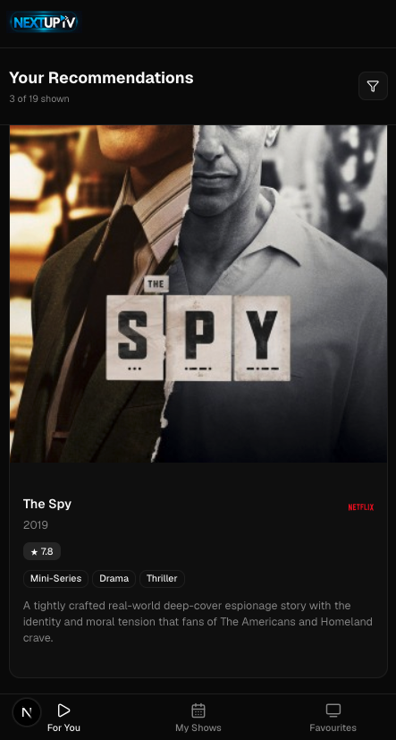

# Product Design Brief

**Document ID:** PDB  
**Related:** [ARCH](02-system-architecture.md) | [PROMPT](04-prompt-engineering-lifecycle.md) | [EVAL](05-evaluation-framework.md) | [SAFETY](06-ai-safety-and-hardening.md) | [STREAM](07-streaming-architecture-and-ux.md) | [OPS](08-observability-and-cost-tracking.md) | [EDL](09-engineering-decision-log.md)  
**Last Updated:** May 2026  
**Status:** Final

---

## 



NextUpTV is a consumer-facing AI recommendation tool built to demonstrate applied AI product engineering — not as a production service. The scope was deliberately constrained to show that deliberate trade-off thinking, not feature volume, is the mark of a senior engineer. The tech stack was chosen for maximum leverage with minimum infrastructure.

---

## 1. Problem Statement

Streaming platforms fragment TV discovery across a dozen competing services, each optimised to surface their own catalogue rather than the best match for a viewer's actual taste. A person who loves _The Wire_, _Succession_, and _Peaky Blinders_ can browse for an hour and surface nothing new.

The hypothesis for this project: a personalised AI layer — given direct knowledge of what a person already loves — can produce recommendations that are more relevant, more diverse, and better explained than any algorithmic system that primarily optimises for watch-time.

The secondary goal was to demonstrate that this capability can be built end-to-end in a small surface area: one API key, no proprietary data, no infrastructure beyond a serverless deployment.

---

## 2. Primary User Profile

**Who:** A regular TV viewer, non-technical, who watches multiple shows across platforms and struggles to find what to watch next.

**Expectations:**
- Consumer-grade UI — immediate feedback, no loading spinners with no progress indication
- Zero configuration — no account creation, no preferences wizard, no settings page
- A recommendation they can trust — a one-sentence explanation they can read and evaluate
- Works on their phone — responsive, usable on mobile without a separate app

**What they bring:** A CSV or text export of their watch history, or a list they type by hand. Some users will have one; others will have neither and just type keywords like "psychological thrillers with strong female leads."

**What they will not tolerate:** A dead screen for 10 seconds, a list of shows they already know, or recommendations with no explanation.

---

## 3. Core Capabilities (v2 Scope)

| Capability | Description |
|------------|-------------|
| AI Recommendations | Claude Sonnet 4.6 generates up to 10 personalised TV show recommendations as structured JSON, streamed in real time |
| File Upload | User uploads a CSV or plain-text file (up to 5 MB) containing watched shows; parsed server-side |
| Keyword Input | Free-text field for genres, actor names, mood descriptors, or show titles — used alongside or instead of a file |
| Real-Time Filtering | Six client-side sliders (runtime, rating, comedy tone, horror tone, release year, count) filter the AI output without additional API calls |
| Show Detail Panel | Click any recommendation card to see full synopsis, cast, and streaming platform links (from TVDB) |
| My Shows Tab | Enter a list of shows to check their TVDB library status: season count, last aired, next episode |
| Session Persistence | Recommendations, filter settings, and favourites input are stored in localStorage and survive page reloads |
| Test / Demo Mode | Pre-generated demo recommendations allow API-free demos and offline development |

---

## 4. Explicit Out-of-Scope Decisions

The following capabilities were considered and deliberately excluded from v2. Each exclusion is a product decision, not an omission.

| Excluded | Reason |
|----------|--------|
| User authentication / accounts | Adds infrastructure complexity (auth service, database, session management) with no user-value payoff at this scope. localStorage persistence covers the primary use case. |
| Database | Session-scoped recommendations don't require persistence beyond the browser. Eliminating the database eliminates a full infrastructure layer. |
| Live streaming platform availability | Platform catalogues change daily; real-time checks require either a commercial API (paid) or scraping (unreliable). Claude's training data is good enough for a soft indicator. |
| Mobile app | Responsive web achieves the mobile use case without a second codebase, App Store review cycles, or platform-specific maintenance. |
| Content moderation | The input domain (TV show titles and genres) and output domain (TV recommendations) are low-risk. Moderation infrastructure is not proportionate to the threat surface. |
| Admin analytics dashboard beyond logs | Full analytics infrastructure (dashboards, alerting, retention metrics) is a production concern; raw JSONL logs with a viewer UI are sufficient for a portfolio project. |

---

## 5. Success Criteria

v2 has no live metrics pipeline. Success was evaluated qualitatively against the following criteria:

1. **Recommendation relevance** — Given a well-known taste profile (e.g. crime dramas: Breaking Bad, The Wire, Ozark), the output set should feel genuinely curated, not generic
2. **Explanation quality** — Every recommended show should include a one-sentence reason that references specific elements of the input, not boilerplate
3. **No input overlap** — Recommendations must never include a show the user already listed, including transliteration variants (e.g. Hebrew "טהרן" and English "Tehran" are the same show)
4. **Streaming UX** — The first recommendation card should appear within 3–5 seconds of submission, not at the end of generation
5. **Eval score** — The built-in LLM-as-judge framework should score the production prompt at B (8.0+) consistently across multiple test presets

The evaluation framework (see `[EVAL]`) was built specifically to make criteria 1–3 and 5 measurable.

---

## 6. Technology Choices and Rationale

| Technology | Role | Why This Choice |
|------------|------|----------------|
| **Next.js 16 App Router** | Full-stack framework | API routes co-located with UI; streaming responses (SSE) work natively; Vercel deployment is one command. No separate backend service needed. |
| **React 19** | UI rendering | Concurrent features for streaming state management; shadcn/ui component library targets React 19 |
| **TypeScript 5.7** | Type safety | Shared interfaces between API routes and client components (`lib/types.ts`) catches integration errors at compile time, not runtime |
| **Tailwind CSS 4** | Styling | Rapid iteration without a design system; dark mode out of the box with `dark:` variants |
| **shadcn/ui** | Component primitives | Accessible, unstyled-by-default components (Sheet, Slider, Badge) that don't impose visual opinions |
| **Claude Sonnet 4.6** | AI model | Best balance of reasoning quality and output speed for structured JSON generation; streaming API allows SSE delivery; significantly cheaper than Opus at scale |
| **@anthropic-ai/sdk v0.95.2** | Anthropic client | Native streaming support (`messages.stream()`); typed response objects |
| **TVDB v4 API** | TV metadata | Richer metadata than TVMaze (content ratings, extended cast, streaming platform companies); official API with stable endpoints; free tier covers this use case |
| **Vercel** | Hosting | Zero-config Next.js deployment; SSE streaming supported natively; `maxDuration = 60` on long-running API routes |
| **ip-api.com** | Geolocation | Free, no-key-required API for IP → city/country lookup; used only in usage logging; fails gracefully |

**What was replaced during development:** TVMaze was the initial metadata provider. It was replaced with TVDB in commit `d45dadc` after TVMaze was found to lack content ratings and to have weaker coverage for streaming platform data. See `[EDL]` for the full decision record.

---

## 7. Starting Wireframe Narrative

The initial UI layout was established via a v0 scaffold (commit `7325071: Adding v0 scaffold`) before any AI integration was written. The layout follows a two-panel information architecture common to filtering-and-results products.

**Desktop layout (>1024px)**

```
┌─────────────────────────────────────────────────────────────────┐
│  NextUpTV                    [My Favourites] [Recommendations]  │
├───────────────────┬─────────────────────────────────────────────┤
│                   │                                             │
│  FILTERS (30%)    │  RECOMMENDATIONS GRID (70%)                 │
│                   │                                             │
│  Runtime          │  ┌──────┐  ┌──────┐  ┌──────┐  ┌──────┐     │
│  ━━━━●━━━━━━      │  │poster│  │poster│  │poster│  │poster│     │
│                   │  │      │  │      │  │      │  │      │     │
│  Rating           │  │title │  │title │  │title │  │title │     │
│  ━━━━━━●━━━       │  │★ 8.5 │  │★ 8.2 │  │★ 8.0 │  │★ 7.9 │     │
│                   │  └──────┘  └──────┘  └──────┘  └──────┘     │
│  Comedy           │                                             │
│  ━━●━━━━━━━       │  ┌──────┐  ┌──────┐  ┌──────┐  ┌──────┐     │
│                   │  │      │  │      │  │      │  │      │     │
│  Horror           │  └──────┘  └──────┘  └──────┘  └──────┘     │
│  ━━━━━━━━●        │                                             │
│                   │                                             │
│  Year             │                                             │
│  ●━━━━━━━━━━●     │                                             │
│                   │                                             │
│  Show count       │                                             │
│  ━━━━━━●━━━       │                                             │
│                   │                                             │
└───────────────────┴─────────────────────────────────────────────┘
```

**Mobile layout (<768px)**

On mobile, the filter panel collapses into a bottom drawer triggered by a "Filters" button. The grid shifts to a single column. The generation status bar is pinned to the top and remains visible while scrolling.

```
┌──────────────────────────┐
│ NextUpTV       [≡ Favs]  │
├──────────────────────────┤
│ ⟳ Generating... 4.2s     │  ← pinned status bar
├──────────────────────────┤
│ ┌────────────────────┐   │
│ │      poster        │   │
│ │  Breaking Bad      │   │
│ │  ★ 9.5  2008       │   │
│ │  Crime, Drama      │   │
│ └────────────────────┘   │
│ ┌────────────────────┐   │
│ │      poster        │   │
│ └────────────────────┘   │
├──────────────────────────┤
│   [  Filters  ▲  ]       │  ← bottom drawer trigger
└──────────────────────────┘
```

**Tab structure**

The navigation uses three tabs:
1. **My Favourites** — file upload and keyword input; the submission entry point
2. **Recommendations** — streaming results view; active during and after generation
3. **My Shows** — TVDB library status for shows in your collection

---

## 8. Production UI Screenshots

### Recommendations Grid (Desktop)


*The production two-panel layout: filter sliders on the left (30%), recommendation cards on the right (70%). Each card shows the TVDB poster, title, IMDb rating, genre tags, streaming platform icons, and a one-line AI-generated reason.*

### Streaming in Progress


*Cards appearing progressively during generation. The status bar shows the current phase and elapsed time. Posters and TVDB metadata are visible before Claude has finished generating the full JSON.*

### Filter Panel Active


*Client-side filtering in action. The Comedy Level and Horror Level sliders use Claude-generated genre scores as their data source. No API call is made on slider change.*

### Show Detail Panel


*The detail flyover panel opened from a recommendation card, showing full synopsis, cast members with images, and streaming platform links sourced from TVDB.*

### Mobile Layout


*The responsive mobile view: full-width card grid, pinned status bar during generation, and the Filters bottom drawer trigger at the bottom of the screen.*

---

## Supporting File References

- [`specs/product-overview.md`](../../specs/product-overview.md) — original product scope document
- [`specs/user-flows.md`](../../specs/user-flows.md) — user journey specification
- [`specs/design-system.md`](../../specs/design-system.md) — colour palette, typography, spacing tokens
- [`specs/features/ManageFavourites.md`](../../specs/features/ManageFavourites.md) — detailed favourites management spec
- [`specs/features/Recommendations.md`](../../specs/features/Recommendations.md) — recommendations feature spec
- [`app/page.tsx`](../../app/page.tsx) — root page entry
- [`components/app-shell.tsx`](../../components/app-shell.tsx) — root layout and tab navigation
- [`components/top-navigation.tsx`](../../components/top-navigation.tsx) — tab nav component
