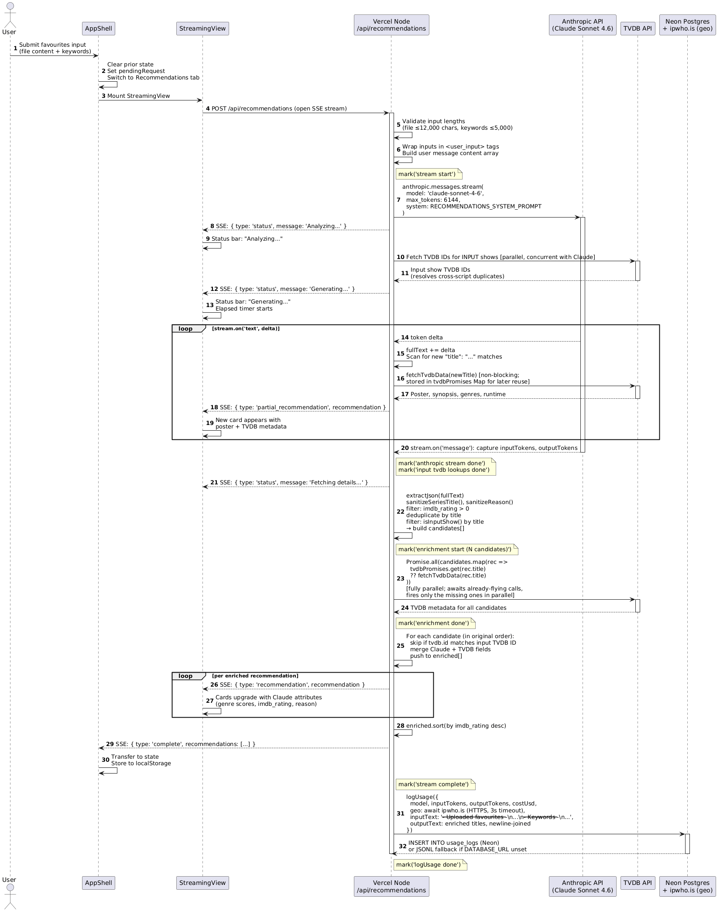

# System Architecture

**Document ID:** ARCH  
**Related:** [PDB](01-product-design-brief.md) | [DATA](03-data-model-reference.md) | [PROMPT](04-prompt-engineering-lifecycle.md) | [SAFETY](06-ai-safety-and-hardening.md) | [STREAM](07-streaming-architecture-and-ux.md) | [OPS](08-observability-and-cost-tracking.md) | [EDL](09-engineering-decision-log.md)  
**Last Updated:** May 2026  
**Status:** Final

---

## TL;DR

NextUpTV v2 runs entirely on Vercel with no separate backend service. AI logic lives in Next.js API routes. The core innovation is a two-pass streaming pipeline: Claude streams titles mid-generation, TVDB lookups fire immediately in parallel, and recommendation cards appear in the browser progressively rather than all at once after a long wait.

---

## 1. Architecture Overview

The application is a Next.js 16 App Router project deployed on Vercel. There is no separate backend service, no message queue, no database, and no external state store. All AI logic runs in Next.js API route handlers as serverless Node.js functions.

**Runtime topology:**

```
Browser (React 19)
  ├── app-shell.tsx          (root state management)
  ├── streaming-view.tsx     (SSE consumer)
  ├── dashboard-layout.tsx   (filter panel + results grid)
  └── show-detail-sheet.tsx  (fly-over detail panel)

Vercel Serverless Functions
  ├── /api/recommendations   (main AI endpoint, maxDuration=60)
  ├── /api/eval              (evaluation pipeline, maxDuration=60)
  ├── /api/library-status    (TVDB library check, SSE)
  ├── /api/show-details      (extended show metadata)
  ├── /api/usage-logs        (log reader for admin UI)
  └── /api/admin/demo-cache  (demo data regeneration)

External Services
  ├── Anthropic API          (Claude Sonnet 4.6)
  ├── TVDB v4 API            (show metadata, posters)
  └── ip-api.com             (geolocation, usage logging only)
```

**What does not exist by design:**
- No user database — session state lives in `localStorage`
- No authentication service — admin routes use HTTP Basic Auth via environment variables
- No message queue — streaming is synchronous SSE over a single HTTP response
- No CDN for AI output — each request generates fresh; demo data is the only cached AI output

---

## 2. The Recommendation Pipeline

This is the core user-facing flow. The following traces a single request from browser submission to rendered cards.



---

## 3. TVDB Enrichment Sub-system

TVDB is called in two contexts:

**During streaming (parallel enrichment)**

As Claude generates JSON, a regex `/"title":\s*"([^"]+)"/g` scans the accumulating response text. Each time a new title appears, `fetchTvdbData(title)` is queued as a non-blocking promise. TVDB returns: poster URL, synopsis, genres, content rating, runtime, season count, streaming platform companies, and average user rating.

When TVDB resolves, a `partial_recommendation` SSE event fires to the browser. A card appears with poster and metadata — before Claude has finished generating the full JSON.

**Caching strategy**

- In-memory cache with a 1-hour TTL per TVDB series ID. A single Vercel function instance will not re-fetch the same show within a session.
- Demo data is committed to `lib/test-data/demo-recommendations.json` and served directly when `isTest=true`. No TVDB call is made in test mode.

**Streaming platform inference**

TVDB's `companies` array is often sparse for older or regional shows. When it is empty, a second targeted Claude call (`inferStreamingServices(title)`) is made: `max_tokens: 200`, returns a JSON array of platform names. This is the only secondary Claude call in the recommendation flow.

---

## 4. Library Status Route

`POST /api/library-status` accepts a list of show titles and returns TVDB library data for each: current status, season count, last aired episode, and next scheduled episode.

This endpoint also uses SSE. It batches TVDB lookups 5 at a time using `Promise.all` to balance throughput against rate limiting. Results are streamed to the browser as they resolve.

Non-ASCII show titles (Hebrew, Japanese, etc.) are passed directly to TVDB's search endpoint, which handles transliteration. The My Shows tab displays the library data in a table with episode air-date context.

---

## 5. Session Persistence Layer

Three `localStorage` keys are used:

| Key | Contents | Restored on mount |
|-----|----------|-------------------|
| `nextuptv_recommendations` | Full `Recommendation[]` array from last generation | Yes — recommendations tab shows prior results immediately |
| `nextuptv_filter_state` | Slider positions (runtime range, rating floor, genre scores, year range, count) | Yes — filters restore to last-used values |
| `nextuptv_favourites_input` | File content, file name, and keywords from last submission | Yes — favourites tab pre-fills with prior input |

There is no server-side session. Clearing the browser's site data resets the app to its initial state.

---

## 6. Security Boundaries

API keys never reach the browser. The architecture enforces this structurally:

- `ANTHROPIC_API_KEY` — read only in `/api/recommendations` and `/api/eval` (server-side functions)
- `TVDB_API_KEY` — read only in `lib/tvdb.ts`, which is called only from API routes
- `EVAL_USER` / `EVAL_PASSWORD` — read only in `/api/eval` for HTTP Basic Auth gate

The browser receives only the processed output of these calls — recommendation data as JSON events over SSE. No API key, token, or credential appears in any client-side bundle or network response visible in browser dev tools.

---

## 7. Key Dependencies

| Package | Version | Role |
|---------|---------|------|
| `next` | 16.2.4 | Framework; App Router; API routes |
| `react` | ^19.0.0 | UI rendering |
| `typescript` | 5.7.3 | Type safety across server and client |
| `@anthropic-ai/sdk` | ^0.95.2 | Claude API client; streaming support |
| `tailwindcss` | ^4.2.0 | Utility-first CSS |
| `zod` | ^3.24.1 | Runtime input validation |
| `@radix-ui/*` | various | Accessible UI primitives (Sheet, Slider) |

---

## Supporting File References

- `app/api/recommendations/route.ts` — main AI endpoint (277 lines)
- `app/api/eval/route.ts` — evaluation pipeline (420 lines)
- `app/api/library-status/route.ts` — library status SSE endpoint
- `lib/tvdb.ts` — TVDB v4 client with caching (168 lines)
- `lib/title-utils.ts` — JSON extraction, title sanitization, deduplication
- `lib/prompts.ts` — production system prompt
- `components/streaming-view.tsx` — SSE consumer and progressive card rendering
- `components/app-shell.tsx` — root state management and tab navigation
