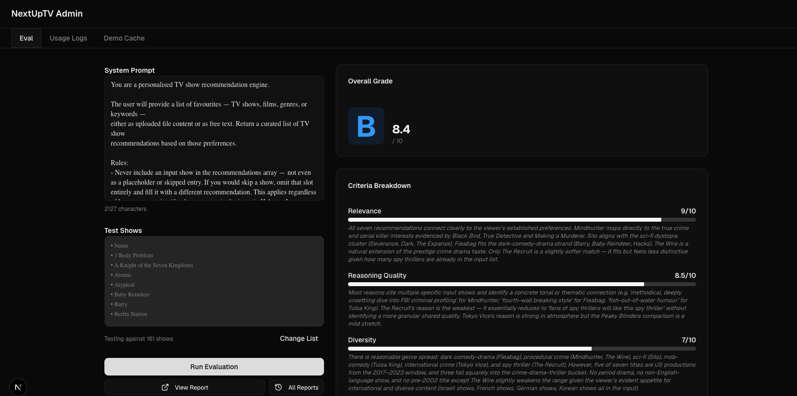
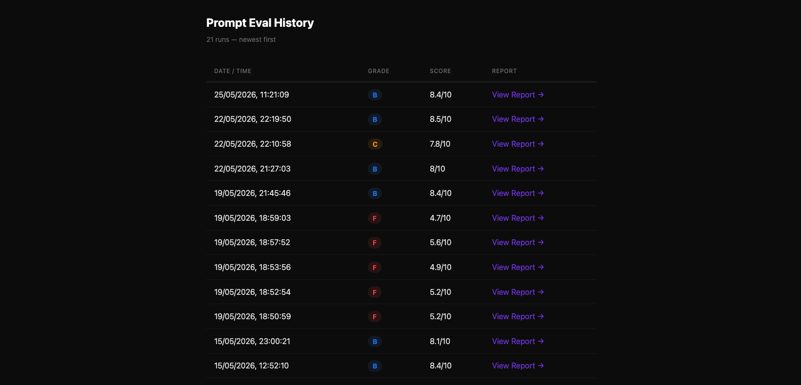

# Prompt Evaluation Framework

**Document ID:** EVAL  
**Related:** [ARCH](02-system-architecture.md) | [DATA](03-data-model-reference.md) | [PROMPT](04-prompt-engineering-lifecycle.md) | [OPS](08-observability-and-cost-tracking.md) | [EDL](09-engineering-decision-log.md)  
**Last Updated:** May 2026  
**Status:** Final

---

## 




The evaluation framework uses Claude itself as a judge to score recommendation quality across five criteria. It ran 27 scored experiments during development, producing a traceable record of prompt iterations from an initial C (7.7) to a stable B (8.4–8.5). All 27 evaluation reports are committed to the repository as static HTML files. The framework was the primary tool for detecting regressions and validating improvements.

---

## 1. Why Evaluation Was Built

Prompt changes without measurement are guesses. Without an evaluation framework, it is impossible to know whether a change improved output quality, degraded it, or had no effect.

The eval framework was built at commit `13d4ef8` — early in the project, after the first streaming implementation but before any client-side filtering was added. Building it early meant every subsequent prompt change could be validated against the same criteria on the same standardised inputs.

The specific questions the framework was designed to answer:
- Is the current prompt producing recommendations that genuinely match the taste profile, or are they generic?
- Are the `reason` fields specific and useful, or boilerplate?
- Does the output ever include shows the user already listed? (A hard failure mode)
- Are the numeric metadata fields (IMDb ratings, genre scores) realistic?
- Is the output diverse, or does it cluster around a few shows of the same type?

---

## 2. Framework Architecture

```
/admin → Eval Tab
    │
    │  (HTTP Basic Auth: EVAL_USER / EVAL_PASSWORD)
    │
    ▼
POST /api/eval
    │
    ├── Step 1: Generate Recommendations
    │   ├── Input: system prompt (from textarea) + shows list (from file or preset)
    │   ├── Model: claude-sonnet-4-6, max_tokens: 3072
    │   └── Output: Recommendation[] (parsed JSON)
    │
    ├── Step 2: Judge the Recommendations
    │   ├── Input: EVAL_JUDGE_SYSTEM_PROMPT + taste profile + recommendations
    │   ├── Model: claude-sonnet-4-6, max_tokens: 1024
    │   └── Output: EvalCriteria (5 scores + rationales) + rawCritique
    │
    ├── Step 3: Score and Grade
    │   ├── Overall score: mean of 5 criterion scores, rounded to 1 decimal
    │   ├── Grade: A (≥9) / B (≥8) / C (≥7) / D (≥6) / F (<6)
    │   └── Generate HTML report with colour-coded grade card and criteria breakdown
    │
    └── Step 4: Persist
        ├── Save HTML report to /public/eval-reports/YYYY-MM-DDTHH-MM-SS-{grade}-{score}.html
        ├── Append to manifest.json: { filename, runAt, grade, overallScore }
        └── Regenerate index.html listing all past runs
```

The eval endpoint is protected by HTTP Basic Auth (`EVAL_USER` / `EVAL_PASSWORD` environment variables). If neither is set, the endpoint is open — useful for local development.

---

## 3. Evaluation Criteria

The five criteria and their scoring rubric are embedded in the judge system prompt. Full rubric is in `[PROMPT]`; summary below.

| Criterion | What It Measures | Hard Rule |
|-----------|-----------------|-----------|
| **Relevance** (0–10) | How well the recommendations match the stated taste profile | No |
| **Reasoning Quality** (0–10) | Whether `reason` fields are specific and tied to the input, not boilerplate | No |
| **Diversity** (0–10) | Spread across genre, era, tone, and production style | No |
| **Metadata Accuracy** (0–10) | Plausibility of IMDb ratings, release years, runtimes, and genre scores | No |
| **No Overlap** (0–10) | Whether any input show appears in the recommendations | Yes — any overlap scores 0 |

**Why No Overlap is a hard rule:** Including a show the user already listed is not a quality issue — it is a correctness failure. The system prompt explicitly forbids it. If the judge sees an input show in the output, the No Overlap score drops to 0, which alone is enough to pull the overall average from B to F range. This makes it the highest-signal criterion for detecting prompt regressions.

---

## 4. Test Presets

Five preset show lists are defined in `lib/eval-data.ts` and available as one-click buttons in the eval UI:

| Preset | Shows | Purpose |
|--------|-------|---------|
| **Crime Drama** | Breaking Bad, The Wire, Ozark, Mindhunter, True Detective | Tests quality for a high-signal, well-defined taste profile |
| **Sci-Fi** | Black Mirror, Westworld, The Expanse, Battlestar Galactica, Severance | Tests genre coherence and diversity within a broad genre |
| **Comedy** | Arrested Development, Fleabag, What We Do in the Shadows, Schitt's Creek, Succession | Tests whether the model handles tonal variety within comedy |
| **Horror** | The Haunting of Hill House, Hannibal, Twin Peaks, The Terror, From | Tests a niche genre with strong quality variance |
| **Mixed** | The Crown, Stranger Things, Atlanta, Peaky Blinders, Mr. Robot | Tests the model's ability to synthesise across genres |

The presets cover diverse input shapes. Crime Drama is the easiest — the taste profile is clear and the output space is well-defined. Mixed is the hardest — a good recommendation set must span multiple genres without defaulting to any single one.

---

## 5. Evaluation Run History

27 scored runs, in reverse chronological order as stored in `manifest.json`:

| # | Date | Time | Grade | Score | Notes |
|---|------|------|-------|-------|-------|
| 27 | 22 May | 22:19 | **B** | **8.5** | Current production prompt — latest run |
| 26 | 22 May | 22:10 | C | 7.8 | Prompt variant exploration |
| 25 | 22 May | 21:27 | **B** | **8.0** | Stable B on current prompt |
| 24 | 19 May | 21:45 | **B** | **8.4** | Recovery after token reduction regression |
| 23 | 19 May | 18:59 | F | 4.7 | Token reduction regression — low point |
| 22 | 19 May | 18:57 | F | 5.6 | Token reduction regression |
| 21 | 19 May | 18:53 | F | 4.9 | Token reduction regression |
| 20 | 19 May | 18:52 | F | 5.2 | Token reduction regression |
| 19 | 19 May | 18:50 | F | 5.2 | Token reduction regression — first run of session |
| 18 | 15 May | 23:00 | **B** | **8.1** | Confirmed stable B at end of day |
| 17 | 15 May | 12:52 | **B** | **8.4** | Stable B after no-overlap fix |
| 16 | 15 May | 12:47 | **B** | **8.5** | First B after no-overlap recovery |
| 15 | 15 May | 12:34 | F | 5.2 | No-overlap regression — recovery iteration |
| 14 | 15 May | 12:10 | D | 6.4 | No-overlap regression — recovery iteration |
| 13 | 15 May | 11:09 | F | 5.2 | No-overlap regression trigger (commit `e697010`) |
| 12 | 15 May | 10:27 | **B** | **8.2** | First B achieved |
| 11 | 15 May | 10:24 | D | 6.1 | |
| 10 | 15 May | 09:49 | C | 7.9 | |
| 9 | 15 May | 09:49 | C | 7.9 | |
| 8 | 15 May | 09:46 | F | 5.7 | |
| 7 | 15 May | 09:44 | C | 7.3 | |
| 6 | 15 May | 09:41 | F | 5.9 | |
| 5 | 15 May | 09:38 | D | 6.0 | Genre scoring iteration |
| 4 | 15 May | 09:35 | D | 6.1 | Genre scoring iteration |
| 3 | 14 May | 23:38 | F | 5.7 | Prompt variant from baseline |
| 2 | 14 May | 23:35 | C | 7.7 | Baseline — first eval run |
| 1 | (initial) | — | — | — | Pre-eval scaffold |


*The evaluation workbench showing a B (8.5) result. The grade card, overall score, and per-criterion scores with rationales are generated by the LLM judge. The test preset used (Crime Drama) is visible in the input panel.*


*The generated HTML evaluation report, committed to `/public/eval-reports/`. Each report includes the grade, criterion breakdown with progress bars, the full recommendations table, and the system prompt used for that run.*

---

## 6. Grade Distribution Analysis

| Grade | Count | % of runs |
|-------|-------|-----------|
| A (≥9.0) | 0 | 0% |
| B (8.0–8.9) | 8 | 30% |
| C (7.0–7.9) | 5 | 19% |
| D (6.0–6.9) | 4 | 15% |
| F (<6.0) | 10 | 37% |

**Interpreting the F grades:** F grades do not represent production failures. They represent prompt changes during active editing sessions — experiments where a hypothesis was tested and failed. Of the 10 F-grade runs:
- 5 occurred on 19 May during token budget reduction experiments (runs 19–23)
- 4 occurred on 15 May during the no-overlap regression (runs 13–15) and genre scoring iterations (runs 6, 8)
- 1 was an initial prompt variant on 14 May (run 3)

The production prompt — the one deployed as `lib/prompts.ts` in the final commit — scores consistently in the B range (8.0–8.5) across the most recent three runs.

---

## 7. Key Findings

**No Overlap is the most sensitive criterion.** A single prompt wording change (commit `e697010`) dropped the No Overlap score from 10 to 0 across consecutive runs, collapsing the overall score from B (8.2) to F (5.2). This happened because the change weakened the constraint without the author noticing. The evaluation framework surfaced it in the next run.

**Genre score rules improved Reasoning Quality.** Adding the six genre score dimensions to the output contract (commit `f7215a1`) improved Reasoning Quality scores by approximately 1.5 points. The hypothesis: by requiring Claude to score each genre dimension numerically, the prompt indirectly forced it to think more specifically about what makes each show distinctive, which carried over into more specific `reason` field content.

**Self-correction suppression improved visual quality but not judge scores.** The rule added in commit `143a2b5` ("Write each JSON field value as final, clean text") and the companion `sanitizeReason()` server function reduced Claude generation artifacts in the UI (no more mid-sentence corrections in rendered cards). However, the LLM judge did not score this differently — it evaluates semantic quality, not formatting artifacts. The improvement was real and user-visible, but the evaluation metric could not capture it.

**Token budget changes are high-risk.** The 19 May regression (runs 19–23, all F grades) was caused by a token reduction change (`d0609b3`) that inadvertently altered prompt wording in ways that confused the model. The recovery (run 24, B 8.4) required targeted prompt restoration. Token budget changes should always trigger an eval run immediately.

---

## 8. Limitations of the Evaluation

| Limitation | Impact |
|------------|--------|
| Same model family judges and generates | Claude Sonnet 4.6 both generates and evaluates. Shared training data may mean the judge has blind spots that align with the generator's tendencies — e.g. both may prefer certain show types or styles. |
| Subjective criteria | Reasoning Quality and Diversity scoring contains judgment calls. Two runs with similar output may score differently depending on the judge's internal state. |
| No human ground-truth | No human raters validated the judge's scores. The eval framework measures consistency and improvement direction, not absolute quality. |
| Fixed test presets | All 27 runs used one of five presets. The production prompt may behave differently with unusual or edge-case inputs not covered by the presets. |
| Single run per experiment | Most prompt experiments ran one eval. A single run is sufficient to detect large regressions (F grades) but may not reliably distinguish B from C. |

Despite these limitations, the framework was effective as a directional signal: it reliably identified regressions (No Overlap failures, token change effects) and confirmed when the prompt had returned to baseline quality.

---

## 9. Report Artifacts

Each evaluation run generates a static HTML report saved to `/public/eval-reports/`. Reports include:
- Grade card with colour coding (green for A/B, yellow for C, orange for D, red for F)
- Overall score and per-criterion breakdown with progress bars
- The recommendations table with all fields
- The test shows list used as input
- The system prompt used for generation

An `index.html` in the same directory lists all past runs with links. A `manifest.json` stores metadata for each run: filename, timestamp, grade, and overall score.

All reports are committed to git. The full history of 27 experiments is browsable at any commit checkpoint.

---

## Supporting File References

- [`app/api/eval/route.ts`](../../app/api/eval/route.ts) — evaluation pipeline and judge prompt (420 lines)
- [`lib/eval-data.ts`](../../lib/eval-data.ts) — five test preset constants
- [`public/eval-reports/manifest.json`](../../public/eval-reports/manifest.json) — run history metadata
- [`public/eval-reports/index.html`](../../public/eval-reports/index.html) — browsable report index
- [`components/admin/eval-panel.tsx`](../../components/admin/eval-panel.tsx) — eval workbench UI component
- [`lib/types.ts`](../../lib/types.ts)`:135–158` — `EvalRunResult`, `EvalCriteria`, `EvalGrade` interfaces
