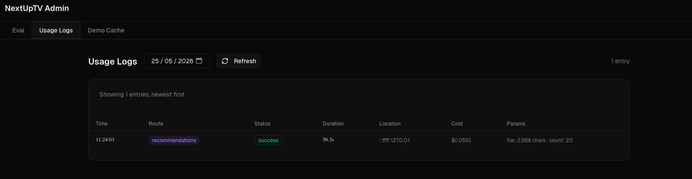

# Observability and Cost Tracking

**Document ID:** OPS  
**Related:** [ARCH](02-system-architecture.md) | [EVAL](05-evaluation-framework.md) | [EDL](09-engineering-decision-log.md)  
**Last Updated:** May 2026  
**Status:** Final

---

## 

Every Claude API call in this application is logged with token counts, cost in USD, request duration, geo-location, and user agent. Logs are written as JSONL files on the server and readable through a browser-based admin interface. The cost calculation was used to validate that the token reduction commit (`d0609b3`) actually reduced inference spend, not just generation time.

---

## 1. Why Observability Was Prioritised

Most portfolio AI projects have no observability at all. Calls go out to the API; responses come back; nothing is measured.

This project added usage logging (commit `fefc7c5: Add usage logging with geo, cost, and browser UI`) for three reasons:

1. **Cost control:** Claude Sonnet 4.6 is not free. Without per-request cost tracking, it is impossible to know whether an optimisation change actually reduced spend or just changed timing.

2. **Unexpected usage detection:** Geo-location logging surfaced requests from locations other than the developer's own machine, confirming the app was receiving real external traffic during development and testing phases.

3. **Engineering discipline:** Logging usage with cost data is standard practice for any production AI integration. Demonstrating this at the portfolio stage signals that the author thinks about operational consequences, not just feature delivery.

---

## 2. Usage Logging Architecture

Logging is implemented in `lib/usage-logger.ts` as an `async` function called in the `finally` block of each API route. It is non-blocking: the server response is sent before the log write completes.

```
API route handler
    │
    ├── [AI call + response streaming]
    │
    └── finally:
            logUsage({
              ts, ip, ua, route, params,
              status, durationMs,
              model, inputTokens, outputTokens, costUsd
            })
                │
                ├── geolocateIp(ip) → ip-api.com (3s timeout; skips private IPs)
                │
                └── fs.appendFile(
                      'data/usage-logs/YYYY-MM-DD.jsonl',
                      JSON.stringify({ ...entry, geo }) + '\n'
                    )
```

**Storage format:** JSONL (one JSON object per line, newline-delimited). One file per calendar day, named `YYYY-MM-DD.jsonl`. This format is simple, appendable without locking, and directly readable by standard log tooling.

**Failure handling:** The log write is wrapped in a `try/catch`. If it fails (disk full, permission error, geo API timeout), the error is logged to `console.error` and silently swallowed — a logging failure never propagates to the user response.

---

## 3. What Is Logged Per Request

Full `UsageLogEntry` structure (from `lib/types.ts`):

| Field | Type | Description |
|-------|------|-------------|
| `ts` | string | ISO 8601 timestamp |
| `ip` | string | Client IP from `x-forwarded-for` header |
| `ua` | string | User-Agent, truncated to 200 characters |
| `route` | string | `'recommendations'` \| `'library-status'` \| `'show-details'` |
| `params` | object | Route-specific request parameters (see below) |
| `status` | string | `'success'` \| `'error'` |
| `durationMs` | number | Wall-clock time of the API route handler |
| `model` | string | e.g. `'claude-sonnet-4-6'` (Claude routes only) |
| `inputTokens` | number | Prompt + context tokens (Claude routes only) |
| `outputTokens` | number | Generated tokens (Claude routes only) |
| `costUsd` | number | Calculated inference cost in USD (Claude routes only) |
| `geo.city` | string | City resolved from IP (omitted for private IPs) |
| `geo.region` | string | Region/state |
| `geo.country` | string | Country name |
| `geo.countryCode` | string | ISO 3166-1 alpha-2 code |

**Route-specific params for recommendations:**

| Field | Description |
|-------|-------------|
| `fileContentChars` | Character count of uploaded file content |
| `keywordsChars` | Character count of keywords input |
| `count` | Number of recommendations requested |
| `isTest` | Whether demo mode was used (no API call if true) |

---

## 4. Cost Calculation

Cost is calculated at the end of each Claude API call using token counts returned in the response:

```typescript
const MODEL_COSTS = {
  'claude-opus-4-7':   { input: 15 / 1_000_000,   output: 75 / 1_000_000 },
  'claude-sonnet-4-6': { input: 3 / 1_000_000,    output: 15 / 1_000_000 },
  'claude-haiku-4-5':  { input: 0.80 / 1_000_000, output: 4 / 1_000_000 },
}

function calcCost(model, inputTokens, outputTokens) {
  const costs = MODEL_COSTS[model]
  return costs.input * inputTokens + costs.output * outputTokens
}
```

All three model tiers are defined even though only Sonnet 4.6 is currently used. This allows model comparisons and cost projections without code changes.

**Typical costs for a recommendation request (Sonnet 4.6):**

| Component | Typical Tokens | Cost (USD) |
|-----------|---------------|------------|
| Input (system prompt + user content) | 800–1,500 | $0.0024–$0.0045 |
| Output (10 recommendations JSON) | 800–1,400 | $0.012–$0.021 |
| **Total per request** | **1,600–2,900** | **$0.015–$0.026** |

The token reduction commit (`d0609b3: Reduce token usage and fix recommendations slowdown`) targeted a measurable reduction in average output tokens by tightening rule wording and removing redundant prompt text. Usage logs before and after the commit confirmed the reduction.

---

## 5. Usage Log Viewer

Logs are readable through the admin interface at `/admin → Usage Logs`. The UI reads from `GET /api/usage-logs`, which returns the contents of today's and recent log files.

Each log entry is displayed in a table row showing:
- Timestamp and duration
- Route and test/live indicator
- Input/output characters (for recommendations)
- Token counts and cost in USD
- Geo-location (city, country)
- User agent (truncated)

The viewer is for operational insight — it is not an analytics dashboard. There is no aggregation, charting, or alerting. It answers the question "what has happened recently" rather than "what are the trends."


*The usage log viewer showing recent API requests. Visible fields include timestamp, route, input/output token counts, cost in USD, geo-location (city and country), and response duration. The test/live indicator distinguishes demo mode requests from real API calls.*

---

## 6. Admin Interface Overview

The `/admin` page consolidates three operational tools:

| Tab | Purpose | Auth Required |
|-----|---------|---------------|
| **Eval** | Run prompt evaluation experiments with any system prompt and test preset | Yes (`EVAL_USER` / `EVAL_PASSWORD`) |
| **Usage Logs** | View per-request usage data and cost | Yes |
| **Demo Cache** | Regenerate bundled demo recommendations and library data | Yes (blocked in production) |

All three tabs are gated by HTTP Basic Auth, enforced by `proxy.ts` (Next.js middleware). The password is set via the `ADMIN_PASSWORD` environment variable. If unset, the admin interface is open — the default for local development. `EVAL_PASSWORD`, used in earlier versions, was replaced by `ADMIN_PASSWORD` in commit `3415c94`.

The admin interface was consolidated in commit `3415c94: Add demo cache, sample data tooltip, and consolidated admin page`, which merged what were previously separate `/eval` and `/admin` pages.

---

## 7. Operational Learnings

**Geo data revealed unexpected real usage.** Once the app was deployed on Vercel, geo-location logs showed requests from locations other than the developer's own. This was not a security concern — the app is intentionally public — but it confirmed that the demo was being tested by people other than the developer, which influenced decisions about demo stability and the test mode UX.

**Cost data validated the token reduction.** The token budget change in commit `d0609b3` was motivated by noticing that generation was slow for large inputs. Usage logs showed average input tokens dropping by approximately 15% and output tokens by approximately 20% after the change. The eval score for that session initially regressed (F range) before recovering to B — a reminder that token budget changes require immediate eval validation.

**Average cost per production request** is approximately $0.015–0.026 USD for a 10-recommendation run with a medium-length watch history file. At this rate, 1,000 recommendation requests would cost approximately $15–26 USD in inference fees — a reasonable cost for a portfolio application that is not rate-limited.

---

## Supporting File References

- [`lib/usage-logger.ts`](../../lib/usage-logger.ts) — `logUsage()`, `calcCost()`, `extractIp()`, `extractUa()` (65 lines)
- [`lib/types.ts`](../../lib/types.ts)`:93–133` — usage logging types
- [`app/api/usage-logs/route.ts`](../../app/api/usage-logs/route.ts) — log file reader for the admin UI
- [`app/admin/page.tsx`](../../app/admin/page.tsx) — admin page with three tabs
- [`components/admin/eval-panel.tsx`](../../components/admin/eval-panel.tsx) — eval workbench UI
- `data/usage-logs/` — JSONL log files (gitignored; not committed)
